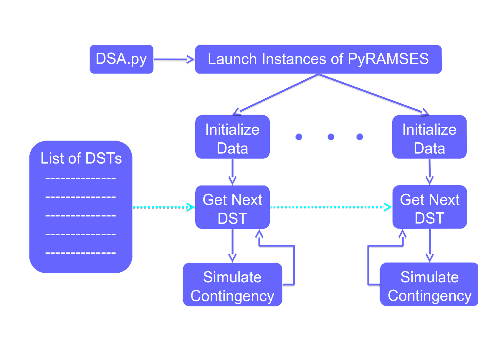

 .. _examples:

********
Examples
********

.. _examples_simple_simul:

Running a simulation
====================

First, the test case should be defined. We assume to open an ipython command window in the folder containing
the data and disturbance file::

   import PyRAMSES
   case = PyRAMSES.cfg()
   case.addOut('output.trace') # save the simulation output
   case.addData('dyn_A.dat') # Dynamic data
   case.addData('volt_rat_A.dat') # power-flow data
   case.addData('settings1.dat') # solver settings
   case.addInit('init.trace') # save initialization procedure
   case.addDst('short_trip_branch.dst') # description of disturbance
   case.addCont('cont.trace') # save continuous trace
   case.addDisc('disc.trace') # save discrete trace
   case.addRunObs('BV 4044') # observe the voltage magnitude of bus 4044 during simulation
   case.addRunObs('BV 1041') # observe the voltage magnitude of bus 1041 during simulation
   case.writeCmdFile('cmd.txt') # Save configuration for future use
   
Next, a simulator instance should be initialized::

   ram = PyRAMSES.sim()
   
Finally, the simulation is executed::

   ram.execSim(case) # run until the end of the simulation
   
.. note::
   
   By modifying the parameter $NBTHREADS inside the solver settings data file, the simulation will be performed
   in parallel. Putting $NBTHREADS to zero, will use all the available computing cores for the simulation.
   
Pause and continue
------------------

The user can pause the simulation at any point. For example::

   ram.execSim(case, 0.0) # start the simulation paused
   ram.contSim(10.0) # simulate until t=10.0 seconds
   ram.contSim(ram.getSimTime() + 60.0) # simulate until t=t+60.0=70.0 seconds. getSimTime() returns the current simulation time
   ram.contSim(ram.getInfTime()) # simulate until the end (time horizon was reached or an early stop happened due to system violations or collapse)
   
   
Get measurements from the system
--------------------------------

When the simulation is paused, we can read the system states::

   ram.execSim(case, 10.0) # start the simulation and pause at t=10.0 seconds
   busNames = ['g1', 'g2', 'g3'] # names of buses we want to observe the voltage at
   voltages = ram.getBusVolt(busNames) # returns a list of voltages
   comp_type = ['EXC', 'EXC']
   comp_name = ['g1', 'g2']
   prm_name = ['V0', 'KPSS']
   prms = ram.getPrm(comp_type, comp_name, prm_name) # returns a list with parameter V0 of synchronous machine g1 and parameter KPSS of synchronous machine g2
   comp_type = ['INJ','EXC','TOR']
   comp_name = ['L_11','g2','g3']
   obs_name = ['P','vf','Pm']
   obs = ram.getObs(comp_type, comp_name, obs_name) # returns a list with observables P of injector L_11, vf of the exciter model of machine g2, and Pm of the torque model of machine g3

Modify parameters
-----------------

At the same time we can modify some parameters of the simulation::

   ram.execSim(case, 80.0) # start the simulation and pause at t=80.0 seconds
   ram.addDisturb(100.000, 'CHGPRM DCTL 1-1041  Vsetpt -0.05 0') # Decrease the setpoint of the DCTL by 0.015 pu, at t=100 s
   ram.addDisturb(100.000, 'CHGPRM DCTL 2-1042  Vsetpt -0.05 0')
   ram.addDisturb(100.000, 'CHGPRM DCTL 3-1043  Vsetpt -0.05 0')
   ram.addDisturb(100.000, 'CHGPRM DCTL 4-1044  Vsetpt -0.05 0')
   ram.addDisturb(100.000, 'CHGPRM DCTL 5-1045  Vsetpt -0.05 0')
   ram.contSim(ram.getInfTime()) # simulate until the end (time horizon was reached or an early stop happened due to system violations or collapse)

For the syntax of CHGPRM you should check the documentation of RAMSES.

Add events/disturbances
-----------------------

With the same time we can add other events to the simulation::

   ram.execSim(case, 80.0) # start the simulation and pause at t=80.0 seconds
   ram.addDisturb(100.000, 'FAULT BUS 4032 0.') # simulate 3ph short-circuit to ground
   ram.addDisturb(100.100, 'CLEAR BUS 4032') # clear short-circuit by tripping line 4032-4044
   ram.addDisturb(100.100, 'BREAKER BRANCH 4032-4044 0 0')
   ram.contSim(ram.getInfTime()) # simulate until the end (time horizon was reached or an early stop happened due to system violations or collapse)

For the syntax of all events you should check the documentation of RAMSES.

.. _examples_dsa:

Running multiple simulations in parallel
========================================

Simulations can be performed in parallel by using several instances of :class:`PyRAMSES.simulator.sim`. This allows two levels of parallelization.
In the Python level, each instance of the simulator should be executed in a different process. In the lower level, inside RAMSES,
each simulation can be parallelized using the $NBTHREADS solver setting. The latter is implemented with multithreading (OpenMP).

An example is shown below (:download:`dsa.py <dsa.py>`), using the package :py:mod:`multiprocessing`:

.. literalinclude:: dsa.py
   :language: python
   :linenos:
   
The script can be copied in the directory where the command files are located and executed as::

   $ python dsa.py cmd1.txt cmd2.txt cmd3.txt cmd4.txt cmd5.txt cmd6.txt cmd7.txt cmd8.txt
   Daemons started and initialized:  4
   Waiting for current jobs to finish
   Waiting for  4  daemons to close
   Finished everything....

The following figure outlines the operation of the script:

